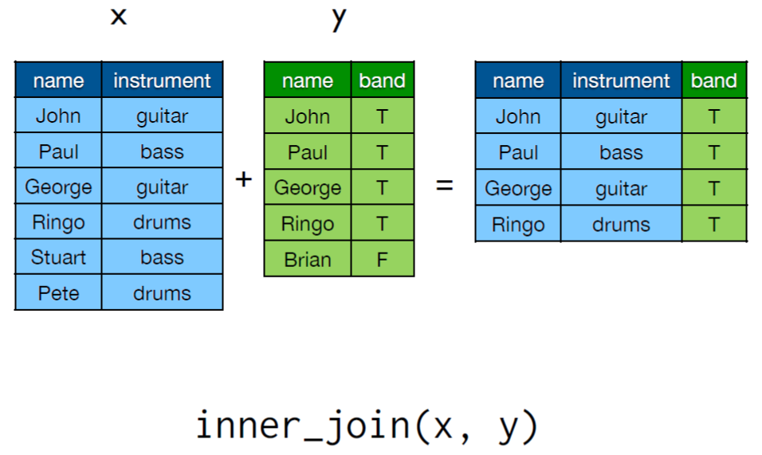
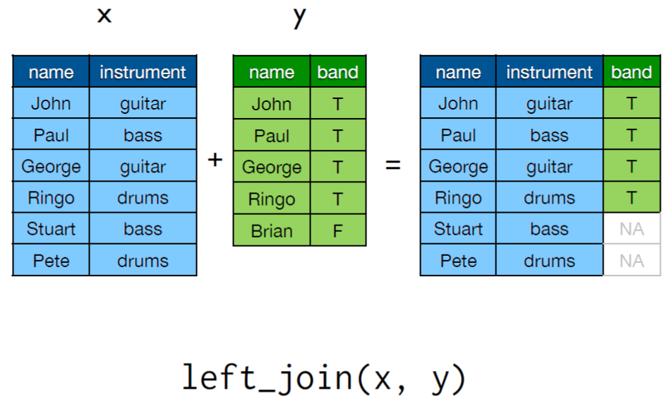
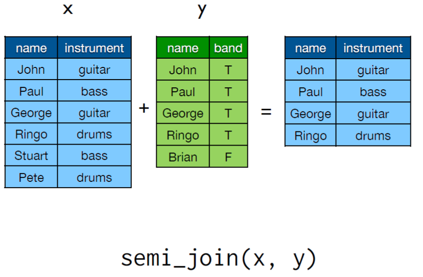
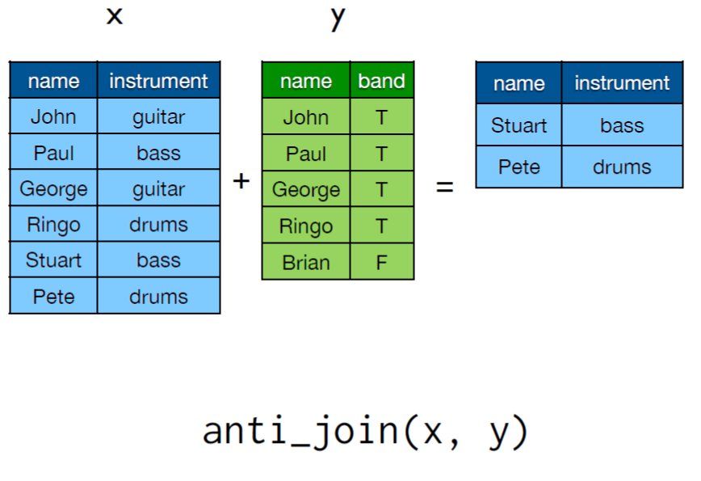

```{r setup, include=FALSE}
knitr::opts_chunk$set(echo = TRUE)
```

## Why use dplyr? 
It is great for data exploration and manipulation when using data frames. Generally, any operation you do with dplyr commands could also be performed using one of the R base commands, but dplyr is more intuitive to write, requires less coding and is easier to read, especially when coming back to code you have written a while ago.  
It allows you to work with data frames, data tables and remote databases by using the same set of functions.  

If you also use the plyr package, load plyr first. 

Below I have compiled code and examples from a dplyr tutorial written by Hadley Wickham with additional comments and explanations. The original R files you can find [here](https://www.dropbox.com/sh/i8qnluwmuieicxc/AAAgt9tIKoIm7WZKIyK25lh6a).    

First, load data of every flight departing from Houston in 2011 and convert to so called local data frame (Local data frame is simply a wrapper for a data frame that prints nicely).  

```{r load data example, echo=T, warning=F, message=F}
#load required packages
library(dplyr)
library(ggplot2)

flights <- tbl_df(read.csv("flights.csv", stringsAsFactors = FALSE))
flights$date <- as.Date(flights$date)
dim(flights)

```

Load remaining data sets on hourly weather data, plane metadata and airport metadata.
Display top of data frames.

```{r load remaining data files, echo=T, warning=F, message=F}
weather <- tbl_df(read.csv("weather.csv", stringsAsFactors = FALSE))
weather$date <- as.Date(weather$date)
dim(weather)

planes <- tbl_df(read.csv("planes.csv", stringsAsFactors = FALSE))

airports <- tbl_df(read.csv("airports.csv", stringsAsFactors = FALSE))

flights
weather
planes
airports

```


To get your data into an adequate format you can use the tidyr functions: gather(), spread() and separate().
Main idea of tidy data is that all your variables are arranged in columns.
Read more about tidyr and format of stored data [here](http://vita.had.co.nz/papers/tidy-data.pdf).


In principle, everything you need to arrange and manipulate your data are a small set of basic commands. So to manipulate your data you will only have to think about which of the following commands will do what you need:  

* Basic commands:  
  + filter(): select rows based on certain criteria matching their values    
  + select(): select certain columns   
  + arrange(): reorder rows and columns of your data frame  
  + mutate(): add new variables to your data frame  
  + summarise(): apply functions (summary statistics) to your data
  
* Some more useful commands:  
  + group_by(): group data by a variable and operate further functions on the grouped data 
  + slice(): select rows by position
  + transmute: similar to mutate, create new variables based on existing ones, but only keep the newly created ones 
  + sample_n(): select random rows from a table
  + sample_frac(): randomly select a  certain fraction of rows from a table

The command structure for all dplyr verbs is always:  
The first argument is a data frame.  
Subsequent arguments define what to do with the data.   
The return value is a data frame.  
Nothing is modified in place.  


### filter()

```{r examples for filter, echo=T, warning=F, message=F}
# select all flights to LOs Angeles
filter(flights, dest == "LAX")
# view the latest result in a separate window
#.Last.value %>% View()

# select all flights with destination LA that were cancelled
filter(flights, dest == "LAX" , cancelled == 1)

# you can also use boolean operators (|, &)
filter(flights, dest == "LAX" & cancelled == 1)
filter(flights, dest == "LAX" & dep_delay > 30)
filter(flights, dest == "LAX" | dest == "DFW")
filter(flights, dest %in% c("LAX","DFW"))

# find all flights in January
filter(flights, date < "2011-02-01")
# find all flights that departed between midnight and 5am
filter(flights, hour >= 0, hour <= 5)

# to select rows by position use slice()
slice(flights, 1:10)

# with r base functions you would write for example..
flights[flights$dest == "LAX" & flights$cancelled == 1, ]


```

### select()

```{r examples for select, echo=T, warning=F, message=F}

# select certain columns
select(flights, dep:arr_delay,dest,plane)
select(flights, -(dep:arr_delay))
select(flights, starts_with("arr"))
select(flights, ends_with("delay"))
select(flights, matches("arr"))
select(flights, contains("arr"))


```

### arrange()

```{r examples for arrange, echo=T, warning=F, message=F}
# order data frame according to date and departure time
arrange(flights, date, dep)
arrange(flights, desc(dep_delay))

# what flights caught up the most during the flight?
arrange(flights, desc(dep_delay - arr_delay))

# in base R you would use the order() command 
flights[order(flights$date, flights$dep), ]
flights[order(flights$dep_delay, decreasing = TRUE), ]
flights[order(-flights$dep_delay), ]


```

### mutate()

```{r examples for mutate, echo=T, warning=F, message=F}
# create new variable 'gain'
mutate(flights, gain = dep_delay-arr_delay)

# assuming the variable 'time' stands for air time.. 
mutate(flights, gain = dep_delay-arr_delay,
                speed_m_per_h = dist/time*60,
                gain_per_h = gain/time*60)

# if you only want to keep the new variables use transmute()
transmute(flights, gain = dep_delay-arr_delay,
                speed_m_per_h = dist/time*60,
                gain_per_h = gain/time*60)

# divide by some number %/%, divide by some number and determine what's left (Modulo)
mutate(flights,
hour = dep %/% 100,
minute = dep %% 100)

```

```{r examples for group_by, echo=T, warning=F, message=F}
# group data by certain criteria (time, type of plane, ..)
by_date <- group_by(flights, date)
by_hour <- group_by(flights, date, hour)
by_plane <- group_by(flights, plane)
by_dest <- group_by(flights, dest)

```

Summary functions are:  
min(x), meadian(x), max(x), quantile(x,p)  
n(x), n_distinct(x), sum(x), mean(x)  
sum(x > 10), mean(x > 10)
sd(x), var(x), iqr(x), mad(x)


```{r examples for summarise, echo=T, warning=F, message=F}
# summarise departure delay for each day

by_date <- group_by(flights, date)
delays <- summarise(by_date,
mean = mean(dep_delay, na.rm = TRUE),
median = median(dep_delay, na.rm = TRUE),
q75 = quantile(dep_delay, 0.75, na.rm = TRUE),
over_15 = mean(dep_delay > 15, na.rm = TRUE),
over_30 = mean(dep_delay > 30, na.rm = TRUE),
over_60 = mean(dep_delay > 60, na.rm = TRUE)
)


```


```{r more functions, echo=T, warning=F, message=F}
# rename variables in your data frame
rename(flights, arrival = arr, departure = dep)

# find unique values !not doing what it's supposed to do!
distinct(flights, dest)

```

## Pipelining: using the pipe operator %>%

Usually, you want to manipulate your dataset by using a sequence of commands. You could either write a series of functions in parentheses like this:   

```{r alternative code, echo=T, warning=F, message=F}
# source causes R to accept its input from the named file or URL or connection. Input is read and parsed from that file until the end of the file is reached, then the parsed expressions are evaluated sequentially in the chosen environment. 
# source("1-data.R")

hourly_delay <- filter(
  summarise(
    group_by(
      filter(flights, !is.na(dep_delay)), 
      date, hour), 
    delay = mean(dep_delay), 
    n = n()), 
  n > 10
)

```

This way of coding makes it hard to follow what exactly was done to the data as one has to start with evaluating the inner parentheses.  
The pipe operator %>% from the magrittr package offers a more straight forward and readable way to pipeline commands. You can read the pipe operator as "then". It takes whatever is on the left side to perform the function on the right side: x %>% f(y) -> f(x, y) :  


```{r pipe operator, echo=T, warning=F, message=F}

hourly_delay <- flights %>% 
  filter(!is.na(dep_delay)) %>%
  group_by(date, hour) %>%
  summarise(
    delay = mean(dep_delay),
    n = n()
  ) %>% 
  filter(n > 10)

```

Here a few example questions on the flights data:  
Which destinations have the highest average
delays?  

```{r pipeline example1, echo=T, warning=F, message=F}
flights %>%
  group_by(dest) %>%
  summarise(arr_delay = mean(arr_delay, na.rm = TRUE), n = n()) %>%
  arrange(desc(arr_delay))
```

Which flights (i.e. carrier + flight) happen every
day? Where do they fly to?

```{r pipeline example2, echo=T, warning=F, message=F}
# tally is a wrapper for summarise that will either call n or sum(n)  depending on whether you're tallying for the first tiem or re-tallying

flights %>% 
  group_by(carrier, flight, dest) %>% 
  tally(sort = TRUE) %>%
  filter(n == 365)

flights %>% 
  group_by(carrier, flight, dest) %>% 
  filter(n() == 365)

```

On average, how do delays (of non-cancelled
flights) vary over the course of a day?
(Hint: hour + minute / 60)

```{r pipeline example3, echo=T, warning=F, message=F}
per_hour <- flights %>%
  filter(cancelled == 0) %>%
  mutate(time = hour + minute / 60) %>%
  group_by(time) %>%
  summarise(arr_delay = mean(arr_delay, na.rm = TRUE), n = n())

```

Plot your data.

```{r plotting data, echo=T, warning=F, message=F}
# data manipulation and plotting
ggplot(filter(per_hour, n > 30), aes(time, arr_delay)) + 
  geom_vline(xintercept = 5:24, colour = "white", size = 2) +
  geom_point()

```


```{r more pipe examples, echo=T, warning=F, message=F}

flights %>%
group_by(carrier, flight, dest) %>%
tally(sort = TRUE) %>% # Save some typing
filter(n == 365)

flights %>%
group_by(carrier, flight, dest) %>%
summarise(n = n()) %>%
arrange(desc(n)) %>%
filter(n == 365)


```

## Two table verbs
If we want to show flight delays on a map, we need to connect the flight information data to the airport data set, which contains geographical information on the different airports.  
In order to connect two data tables we can sue the join() verbs:  

Type | Action  
------------ | -------------  
inner   | include only rows in **both** data tables x and y 
left       | include all of x , and matching rows of y
semi   | include rows of x that match y
anti       | include rows of x that **don't** match y
full     | retain all rows
right    | include all of y, and matching rows of x







```{r joins, echo=T, warning=F, message=F}
location <- airports %>%
select(dest = iata, name = airport, lat, long)

flights %>%
group_by(dest) %>%
filter(!is.na(arr_delay)) %>%
summarise(
arr_delay = mean(arr_delay),
n = n()
) %>%
arrange(desc(arr_delay)) %>%
left_join(location)


hourly_delay <- flights %>%
group_by(date, hour) %>%
filter(!is.na(dep_delay)) %>%
summarise(
delay = mean(dep_delay),
n = n()
) %>%
filter(n > 10)
delay_weather <- hourly_delay %>% left_join(weather)

qplot(temp, delay, data = delay_weather)
qplot(wind_speed, delay, data = delay_weather)
qplot(gust_speed, delay, data = delay_weather)
qplot(is.na(gust_speed), delay, data = delay_weather,
geom = "boxplot")
qplot(conditions, delay, data = delay_weather,
geom = "boxplot") + theme(axis.text.x = element_text(angle = 90, hjust = 1))
qplot(events, delay, data = delay_weather,
geom = "boxplot")


```

In case you want to do something that is not covered by any of the basic verbs you can use do(). It's slower, but adjustable to any purpose you specify, which can be very handy when using models. It's equivalent to ddply() and dlply().

```{r do() function example, echo=T, warning=F, message=F}

# The aim is to fit a linear model to each day, predicting
# delay from time of day

usual <- flights %>%
mutate(time = hour + minute / 60) %>%
filter(hour >= 5, hour <= 20)

models <- usual %>%
group_by(date) %>%
do(
mod = lm(dep_delay ~ time, data = .)
)

# source causes R to accept its input from the named file or URL or connection. Input is read and parsed from that file until the end of the file is reached, then the parsed expressions are evaluated sequentially in the chosen environment. 
# source("filename.R")

```


